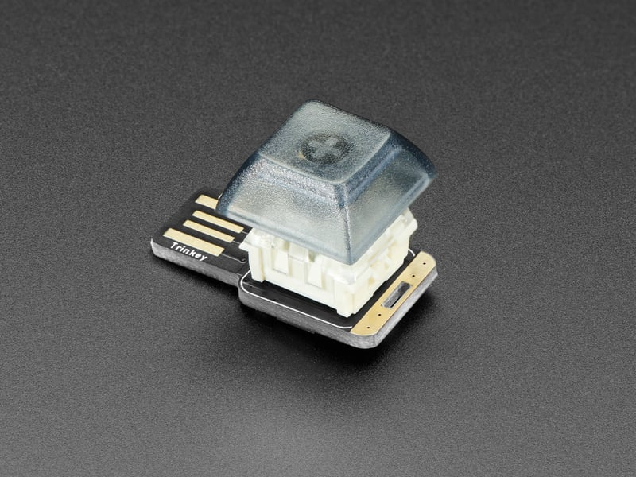

# NeoKey Trinkey GitHub Launcher


### A simple CircuitPython project for the Adafruit NeoKey Trinkey M0 that launches your GitHub profile page with a single button press.

## Overview

This project turns your NeoKey Trinkey into a quick-launch button for your GitHub profile. Simply press the button, and it will automatically open Firefox and navigate to your GitHub page.

## Features

- **One-button GitHub launch** - Press the button to instantly open your GitHub profile
- **Visual feedback** - Blue LED indicates ready state, green LED flashes when button is pressed
- **USB HID Keyboard** - Uses HID keyboard emulation to interact with your computer
- **Automatic browser launch** - Opens Firefox and navigates to your GitHub URL

## Hardware Requirements

- [Adafruit NeoKey Trinkey M0](https://www.adafruit.com/product/5020)
- Cherry MX-compatible mechanical key switch (soldered to the board)
- Windows PC with Firefox installed

## Software Requirements

- [CircuitPython 10.0.3+](https://circuitpython.org/board/adafruit_neokey_trinkey_m0/)
- Required CircuitPython libraries (see Installation section)

## Project Structure

```
.
├── code.py                 # Main program file (runs automatically on boot)
├── lib/                    # CircuitPython libraries
│   └── adafruit_neokey/   # NeoKey hardware support library
│       ├── __init__.py
│       └── neokey1x4.mpy
├── boot_out.txt           # CircuitPython boot output (system file)
└── README.md              # This file
```

## 🚀 Installation

### 1. Install CircuitPython

1. Download the latest CircuitPython UF2 file for NeoKey Trinkey M0 from [circuitpython.org](https://circuitpython.org/board/adafruit_neokey_trinkey_m0/)
2. Double-click the reset button on your NeoKey Trinkey to enter bootloader mode
3. Drag the downloaded `.uf2` file onto the `TRINKEYBOOT` drive
4. Wait for the device to restart - you should see a `CIRCUITPY` drive

### 2. Install Required Libraries

1. Download the [Adafruit CircuitPython Library Bundle](https://circuitpython.org/libraries) (match your CircuitPython version)
2. Extract the bundle
3. Copy the following libraries from the `lib` folder to your `CIRCUITPY/lib/` folder:
   - `adafruit_hid/` (for keyboard emulation)
   - `adafruit_neokey/` (for NeoKey hardware support - already included in this repo)

### 3. Install the Project Files

1. Copy `code.py` to the root of your `CIRCUITPY` drive
2. Ensure the `lib/adafruit_neokey/` folder is in your `CIRCUITPY/lib/` directory

### 4. Customize the URL (Optional)

Edit `code.py` and change line 78 to your desired GitHub URL:

```python
layout.write("https://github.com/MAX-P0W3R")  # Change this to your GitHub username
```

Or modify it to open any URL you prefer.

## Usage

1. Plug your NeoKey Trinkey into a USB port on your Windows PC
2. The LED will turn blue, indicating the device is ready
3. Press the mechanical switch button
4. The LED will briefly flash green
5. Firefox will automatically launch and navigate to your GitHub profile

## Configuration

### Button Pull Configuration

This project uses `Pull.DOWN` configuration for the button. If your switch behaves differently, you may need to adjust:

- **Pull.DOWN** (current): `False` = not pressed, `True` = pressed
- **Pull.UP**: `True` = not pressed, `False` = pressed

To change, modify line 23 in `code.py` and adjust the button logic accordingly.

### Browser Configuration

To use a different browser, modify the launch sequence in `code.py` (around line 66):

- **Firefox** (current): `layout.write("firefox")`
- **Chrome**: `layout.write("chrome")`
- **Edge**: `layout.write("msedge")`

### LED Colors

- **Blue** `(0, 0, 50)`: Ready/idle state
- **Green** `(0, 255, 0)`: Button pressed / action executing

To change colors, modify the `pixel.fill()` calls in `code.py`.

## Troubleshooting

### Button Not Responding

1. Check that your switch is properly soldered to the board
2. Verify the switch is connected to the correct pins
3. Try the diagnostic script (if included) to test button detection
4. Check the serial console output for error messages

### Browser Not Opening

1. Ensure Firefox is installed and accessible via Run dialog (Win+R → "firefox")
2. Adjust the timing delays in `code.py` if your computer is slow
3. Check that no other applications are intercepting keyboard input

### Serial Console Output

Connect via serial console (115200 baud) to see debug messages:
- "=== Starting NeoKey Trinkey ===" - Device initialized
- "Button configured with Pull.DOWN" - Button ready
- "*** BUTTON PRESSED! ***" - Button detected
- "*** Command sent! ***" - Keyboard commands sent

## Resources & Documentation

### Images



### Adafruit NeoKey Trinkey

- [Product Page](https://www.adafruit.com/product/5020)
- [Learn Guide](https://learn.adafruit.com/adafruit-neokey-trinkey)
- [CircuitPython Downloads](https://circuitpython.org/board/adafruit_neokey_trinkey_m0/)
- [Schematic](https://learn.adafruit.com/assets/103516)

### CircuitPython Documentation

- [CircuitPython Documentation](https://docs.circuitpython.org/)
- [CircuitPython Libraries](https://circuitpython.org/libraries)
- [Adafruit HID Library](https://docs.circuitpython.org/projects/hid/en/latest/)
- [NeoPixel Library](https://docs.circuitpython.org/projects/neopixel/en/latest/)

### Development Tools

- [Mu Editor](https://codewith.mu/) - Recommended IDE for CircuitPython
- [CircuitPython Serial Console Guide](https://learn.adafruit.com/welcome-to-circuitpython/kattni-connecting-to-the-serial-console)

## License

This project is open source. Feel free to modify and use as needed.

## Contributing

Pull requests and issues are welcome! If you have improvements or find bugs, please open an issue or submit a PR.

## Disclaimer

This project uses USB HID keyboard emulation. Use responsibly and only on your own devices. The author is not responsible for any misuse of this code.

## Author

**MAX-P0W3R**

- GitHub: [@MAX-P0W3R](https://github.com/MAX-P0W3R)

---

**Made with ❤️ using CircuitPython and Adafruit hardware**

